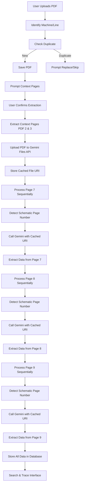
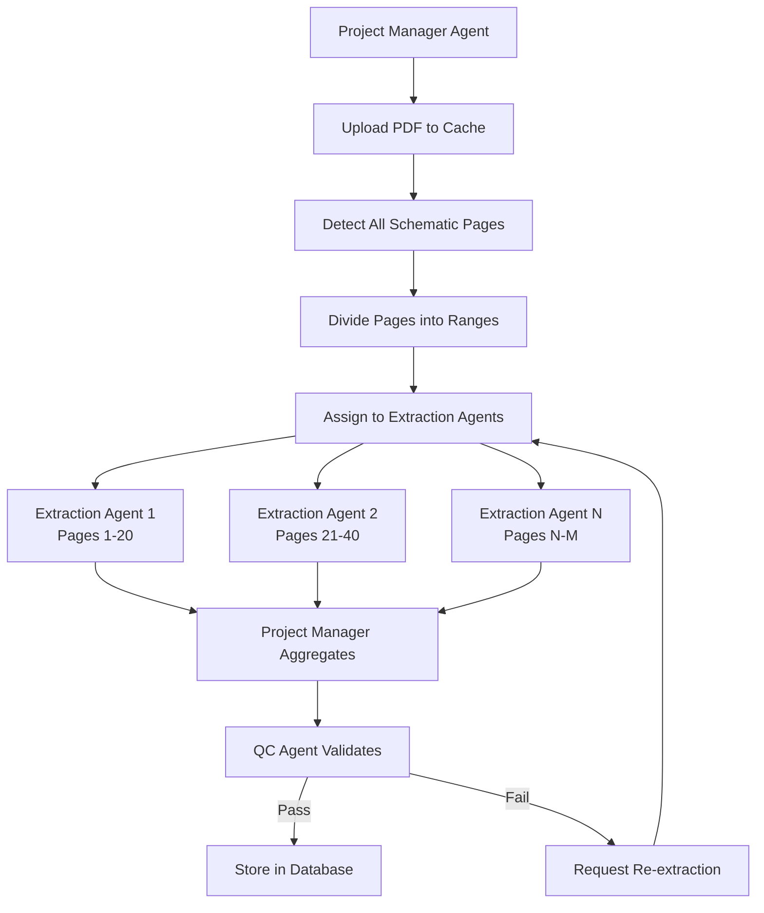

# Schematic Extraction MVP - Single Source Plan

This document is the single source of truth for the current plan. It mirrors the active plan in `.cursor/plans/schematic_extraction_mvp_6ddb6e97.plan.md` with the latest updates, including agent-ready design notes and future enhancements.

## Architecture Overview

**MVP**: Flask-based web application with minimalistic black/white UI that allows users to upload schematic PDFs, extract components/connections/wire labels using Gemini 3 API with context caching, and provide search/tracing capabilities.

**Post-MVP**: Migrate to FastAPI for native async support, enabling parallel Gemini API calls, better streaming (SSE/WebSockets), and improved performance for multi-agent orchestration.

## Data Flow (MVP - Sequential)



## MVP Scope

- PDF Pages to Process: 7, 8, 9 (physical pages in PDF)
- Processing Mode: Sequential (7 → 8 → 9)
- Schematic Pages: Detect from title blocks (“X/207”)
- Context Pages: PDF pages 2 and 3 (user-provided PDF page numbers)
- Page Detection: Parse title blocks to map PDF page index → schematic page number

## Production Scale Requirements (Post-MVP)

- 100+ page schematics; 20+ cross-reference PDFs
- Performance target: minutes, not hours
- Architecture: multi-agent system for parallel processing at scale
- Database: Migrate from SQLite to PostgreSQL for concurrent access
- Framework: Migrate from Flask to FastAPI for native async support
- Deployment: Docker containerization with environment-specific configs

## Future Enhancement: FastAPI Migration (Post-MVP)

### Why FastAPI After MVP
- **Native Async**: True async/await support for concurrent Gemini API calls
- **Better Streaming**: Native SSE and WebSocket support for real-time updates
- **Pydantic Integration**: Built-in request/response validation (already planned for agent-ready design)
- **Performance**: ASGI-based, handles concurrent requests efficiently
- **Auto-Documentation**: OpenAPI/Swagger docs generated automatically
- **Agent-Friendly**: Better suited for multi-agent orchestration patterns

### Migration Strategy
1. **Timing**: After MVP validation (3 pages working end-to-end)
2. **Approach**: Parallel development - new FastAPI app alongside Flask
3. **Service Reuse**: All services (gemini_service, pdf_processor, extraction_service, validation_service, overlay_service) remain unchanged - only routes/app layer changes
4. **Database**: Same SQLAlchemy models, no schema changes
5. **Testing**: Run both apps simultaneously during migration, compare outputs

### FastAPI File Structure (Post-MVP)
```
Atlas-Industrial Schematic Analysis v1/
├── main.py                # FastAPI entry point (replaces app.py)
├── api/
│   ├── __init__.py
│   ├── routes.py          # FastAPI routers
│   ├── schemas.py         # Pydantic request/response models
│   └── dependencies.py    # Dependency injection
├── services/              # Existing services (unchanged)
│   ├── gemini_service.py
│   ├── pdf_processor.py
│   ├── extraction_service.py
│   ├── validation_service.py
│   └── overlay_service.py
├── models.py              # SQLAlchemy models (unchanged)
├── config.py              # Config (unchanged)
├── static/                # Frontend (unchanged)
├── templates/             # Jinja2 templates (FastAPI supports)
└── ...
```

### FastAPI Route Examples
```python
from fastapi import FastAPI, BackgroundTasks
from fastapi.responses import StreamingResponse
from sse_starlette.sse import EventSourceResponse
import asyncio

app = FastAPI()

@app.post("/api/extract")
async def extract_schematic(
    request: ExtractionRequest,
    background_tasks: BackgroundTasks
):
    # Start extraction in background
    background_tasks.add_task(run_extraction, request.schematic_file_id)
    return {"status": "started", "schematic_file_id": request.schematic_file_id}

@app.get("/api/extraction-stream/{schematic_file_id}")
async def stream_extraction(schematic_file_id: int):
    async def event_generator():
        async for event in extraction_events(schematic_file_id):
            yield {"event": event.type, "data": event.data}
    
    return EventSourceResponse(event_generator())

# Parallel page extraction (post-MVP)
async def extract_pages_parallel(pages: list[int], cached_uri: str):
    tasks = [extract_page_async(page, cached_uri) for page in pages]
    results = await asyncio.gather(*tasks, return_exceptions=True)
    return results
```

### Migration Checklist
- [ ] Create FastAPI app structure
- [ ] Port routes to FastAPI routers with Pydantic schemas
- [ ] Implement SSE streaming for extraction progress
- [ ] Add async wrappers for Gemini API calls
- [ ] Update frontend to use new endpoints (minimal changes - same API contract)
- [ ] Load test with 100+ page schematic
- [ ] Switch production to FastAPI
- [ ] Deprecate Flask app

## Future Enhancement: Parallel Processing

- Post-MVP (after FastAPI migration): parallel extraction across multiple pages
- Start with 20 pages in parallel; scale to all pages
- Upload once, reuse cached file URI for all calls
- Use asyncio.gather() for concurrent Gemini API calls
- Extraction service designed to support sequential (MVP) and parallel (future) modes

## Future Enhancement: Multi-Agent Architecture

- Project Manager Agent: orchestrates, assigns pages, aggregates, retries
- Extraction Agents: parallel page/page-range extraction using cached URI
- QC Agent: validates data mirrors schematic exactly
- Goal: process full schematic + cross-refs in minutes

### Agent Workflow (Post-MVP)



## File Structure

```
Atlas-Industrial Schematic Analysis v1/
├── app.py                 # Flask entry point
├── config.py              # Config management
├── models.py              # SQLAlchemy models
├── gemini_service.py      # Gemini 3 API + context caching
├── pdf_processor.py       # PDF manipulation (PyMuPDF, pdfplumber)
├── extraction_service.py  # Orchestrates extraction workflow
├── validation_service.py  # QC/Validation - mirrors schematic accuracy
├── overlay_service.py     # PDF overlay generation
├── routes.py              # Flask routes/endpoints
├── static/
│   ├── css/
│   │   └── style.css      # Minimalistic black/white styling
│   └── js/
│       └── main.js        # Frontend JS
├── templates/
│   └── index.html         # Main UI
├── uploads/               # Stored PDFs
├── .env                   # GEMINI_API_KEY
├── requirements.txt       # Python deps
└── schematic_analysis.db  # SQLite database
```

## Database Schema (MVP - Schematic Only)

1) machines  
   - id (PK), name, created_at

2) schematic_files  
   - id (PK), machine_id (FK), filename, filepath, file_hash, context_pages (JSON), gemini_file_uri, extraction_status (pending|in_progress|completed|failed|partial), extraction_started_at, extraction_completed_at, total_pages_processed, uploaded_at

3) schematic_pages  
   - id (PK), schematic_file_id (FK), pdf_page_index (int, idx), schematic_page_number (int, idx), width, height, detection_confidence, is_processed, detected_at

4) components  
   - id (PK), schematic_file_id (FK), symbol, name, mark (idx), type, pdf_page_index (idx), schematic_page_number (idx), x, y, width, height, description (nullable), created_at  
   - Unique: (schematic_file_id, mark, pdf_page_index)

5) connections  
   - id (PK), schematic_file_id (FK), from_component_id (nullable), to_component_id (nullable), from_component_mark (nullable), to_component_mark (nullable), wire_label, terminal_from (nullable), terminal_to (nullable), pdf_page_index, schematic_page_number, path_coordinates (JSON), is_external (bool), created_at

6) wire_labels  
   - id (PK), schematic_file_id (FK), label (idx), pdf_page_index (idx), schematic_page_number (idx), x, y, created_at

7) continuations  
   - id (PK), schematic_file_id (FK), from_component_mark (nullable), pdf_page_index, schematic_page_number, to_page_hint (string), direction (string, nullable), is_external (bool), created_at

8) extraction_errors  
   - id (PK), schematic_file_id (FK), pdf_page_index, error_type, error_message, error_details (JSON), retry_count, created_at

9) validation_results  
   - id (PK), schematic_file_id (FK), pdf_page_index (nullable), validation_type (page|full_file|component|connection|wire_label), status (pass|fail|warning), confidence_score, discrepancies (JSON), validated_at

## Implementation Components

### Gemini Service (gemini_service.py)
- Upload once; store cached file URI; reuse for all calls
- Rate limits/backoff: configurable concurrency, exponential backoff with jitter on 429/5xx; per-call timeout; capped retries
- Extraction prompts: components, connections, wire labels; page-specific extraction via cached URI
- Error handling: fail-fast

#### Gemini 3 API Configuration (Released Nov 18, 2025)

**Models** (use current, not deprecated):
| Model | Use Case | Notes |
|-------|----------|-------|
| `gemini-3-pro` | Complex schematic extraction | Primary model for MVP |
| `gemini-3-flash` | Bulk/simple operations | 1000 RPM, cost-effective |
| `gemini-3-pro-deepthink` | Complex problem-solving | Enhanced reasoning |

**Key Parameters** (NEW in Gemini 3):
```python
generation_config = {
    "temperature": 0.1,  # Low for accuracy
    "thinking_level": "medium",  # NEW: controls reasoning depth (low/medium/high)
    "response_mime_type": "application/json",
    "response_schema": extraction_schema  # NEW: Native JSON Schema support
}

# Media resolution for PDFs (CRITICAL for schematics)
# Default OCR resolution changed in Gemini 3 - must explicitly set for dense documents
media_resolution = "high"  # Options: low, medium, high (use "high" for schematics)
```

**Structured Output with JSON Schema** (NEW - perfect for our extraction):
```python
# Define schema for extraction output
extraction_schema = {
    "type": "object",
    "properties": {
        "components": {
            "type": "array",
            "items": {
                "type": "object",
                "properties": {
                    "symbol": {"type": "string"},
                    "name": {"type": "string"},
                    "mark": {"type": "string"},
                    # ... full schema
                },
                "required": ["symbol", "name", "mark", "pdf_page_index"]
            }
        },
        # connections, wire_labels...
    }
}

# Model now enforces schema compliance - no parsing errors!
response = model.generate_content(
    contents=[pdf_file, prompt],
    generation_config={
        "response_mime_type": "application/json",
        "response_schema": extraction_schema
    }
)
```

**Thought Signatures** (NEW - for function calling transparency):
- Provides insights into model reasoning process
- Useful for debugging extraction decisions
- Enable in config for complex extractions

#### Gemini API Constraints (Updated for Gemini 3)
| Constraint | Limit | Handling |
|------------|-------|----------|
| File size | 20MB per PDF | Split large PDFs or compress |
| Rate limit (Pro) | 60 RPM | Queue with backoff |
| Rate limit (Flash) | 1000 RPM | Use for bulk operations |
| Context window | 1M tokens | Sufficient for most schematics |
| Cached content TTL | 48 hours | Re-upload if expired |
| Max pages per call | ~50 (recommended) | Batch if more |
| Timeout | 60s default | Extend for complex pages |

**Migration Notes (from Gemini 2.x)**:
- Default OCR resolution changed - use `media_resolution: "high"` for dense PDFs
- Token consumption increased for PDFs (monitor usage)
- Deprecated models: `gemini-2.0-flash-live-001`, `gemini-live-2.5-flash-preview` (shut down Dec 9, 2025)

#### File Search API (NEW - Future Cross-Referencing)
- Launched Nov 6, 2025 in public preview
- Enables grounding responses in user data
- Potential use: Cross-reference schematic data with cable lists, parts lists
- Evaluate for post-MVP cross-referencing feature

#### Cost Management
- Track API calls per extraction (store in extraction_errors or separate table)
- Estimate cost before extraction: ~$0.01-0.05 per page (varies by complexity)
- Optional: daily/monthly spending caps with alerts
- Use Flash for bulk/simple operations, Pro for complex extraction

### PDF Processor (pdf_processor.py)
- Extract context pages (user PDF page numbers, e.g., 2 & 3)
- Detect schematic page numbers from title blocks (“X/207”)
- Page mapping persisted in schematic_pages
- Coordinate conversion: pdfplumber (top-left) ↔ PyMuPDF (bottom-left)
- PDF manipulation: PyMuPDF for overlays

### Extraction Service (extraction_service.py)
- Sequential MVP loop: pages 7 → 8 → 9
- Steps per page: extract page → detect schematic page number → call Gemini with cached URI → stream parse → map to PDF & schematic pages → validate → store
- Final validation pass across all pages
- Context caching: single upload, reused URI
- Resume/retry: status pending → in_progress → (completed|failed|partial); per-page retries with backoff; resume without re-upload
- Agent-ready: modular, stateless where possible, clear IO, structured errors
- Future: parallel processing using cached URI; orchestrated by PM Agent; page extractions delegated to Extraction Agents

### Validation Service (validation_service.py)
- Purpose: verify extracted data mirrors schematic exactly (not circuit correctness)
- Checks: completeness, accuracy, coordinates, connections, wire labels, page mapping, data integrity
- Methods: visual checks (Gemini spot-check), pattern validation, cross-reference validation, coordinate bounds, completeness scoring
- External/out-of-scope: mark connections/continuations pointing to unprocessed pages; surface flags in UI/reports
- Agent-ready; future: QC Agent with advanced reasoning and retries

#### Validation Thresholds (Configurable)
| Metric | Pass | Warning | Fail |
|--------|------|---------|------|
| Component completeness | ≥95% | 80-95% | <80% |
| Connection completeness | ≥90% | 70-90% | <70% |
| Wire label completeness | ≥90% | 75-90% | <75% |
| Coordinate accuracy | ≤5px error | 5-15px | >15px |
| Page number detection | 100% | - | <100% |

#### Validation Gates
- **Blocks "completed" status**: Any metric in "Fail" range
- **Triggers re-extraction**: Failed pages flagged for retry (max 3 attempts)
- **Manual review**: Warning-level results surfaced in UI for user verification
- **Spot-check sampling**: Validate 10% of components visually using Gemini (configurable)

### Overlay Service (overlay_service.py)
- Highlights: red (selected component), blue (connected components), green (wire labels), orange (paths)
- Uses stored page dimensions; coordinate conversion with padding epsilon to avoid clipping
- Generates overlay PDF bytes

### Flask Routes (routes.py)
- GET / — Main UI
- POST /api/upload — Upload PDF, machine id, duplicate check
- POST /api/extract — Start extraction (with context pages), returns extraction ID
- GET /api/extract/{id}/stream — SSE stream for extraction progress
- POST /api/extract/{id}/cancel — Cancel running extraction
- GET /api/search?q= — Search components
- GET /api/trace/<component_id> — Circuit trace
- GET /api/trace/mark/<mark> — Trace by mark
- GET /api/pdf/trace/<component_id> — PDF with overlay
- GET /api/components — List components for machine (paginated)
- GET /api/extraction-status/<schematic_file_id> — Extraction status + data
- GET /api/export/<schematic_file_id>?format=json|csv — Export extracted data

### Frontend (templates/index.html, static/css/style.css, static/js/main.js)
- Minimalistic black background, white text; text-only buttons; glow + slow pulse on clickable items
- Upload flow: file input, machine/line input, duplicate check (replace/skip), context pages (PDF page #), confirm extraction
- Extraction view: streaming table (Type, Mark/Label, Pages PDF+schematic, Details), live status
- Search, component view with page numbers, PDF viewer with overlays (PDF.js or similar)

## Key Implementation Details

### Agent-Ready Design
- Modular, stateless where possible; clear IO contracts; idempotent; structured errors; progress reporting; easy tool wrapping

### Processing Strategy
- MVP: sequential (7 → 8 → 9); simple, debuggable
- Future: parallel; 20+ pages concurrent; cached URI; requires concurrency control and aggregation

### Page Detection Logic
- Parse title block (“X/207”); regex `(\d+)/(\d+)`; persist mapping in schematic_pages; validate sequential; fallback to PDF index with flag

### Duplicate Detection
- SHA-256 hash; prompt replace/skip; if replace and same hash, reuse cached URI; else re-upload/overwrite

### Context Pages
- Prompt for PDF page numbers (defaults 2,3); extract before main extraction; include in prompts

### Prompt Structure (Gemini 3)
- Use native JSON Schema for structured output (enforced by API)
- Include context pages as file references
- Include page mapping in prompt
- Set `media_resolution: "high"` for dense schematic PDFs
- Set `thinking_level: "medium"` for balanced reasoning/speed
- Use `thought_signatures` for debugging extraction logic (optional)
- Required output fields: page_width, page_height, full paths, is_external flag

### Streaming Contract
- **Protocol**: Server-Sent Events (SSE) for MVP (simpler, one-way); WebSocket for post-MVP (bidirectional, cancellation)
- **Events**: progress/component/connection/wire_label/validation/error/complete
- **Ordering**: include `schematic_file_id` and `seq` (sequence number) for ordering/de-dupe
- **Progress Tracking**: `{"type": "progress", "page": 7, "pages_total": 3, "percent": 33, "items_extracted": 15}`
- **Cancellation**: POST `/api/extract/{id}/cancel` (sets status to "cancelled", stops processing)
- **Reconnection**: Client can reconnect and resume from last `seq` received

### Coordinate Handling
- Store coords in pdfplumber system; convert with page dimensions; padding epsilon to avoid clipping

### Resume/Retry
- Status lifecycle; per-page retries with backoff; resume without re-upload using cached URI

### Continuations / External References
- Store continuation markers; flag external connections; surface in UI and validation

### Security / Limits
| Constraint | Value | Rationale |
|------------|-------|-----------|
| Allowed file types | .pdf only | Schematics are PDFs |
| Max file size | 100MB | Gemini limit is 20MB, but we store original |
| Max concurrent extractions | 3 per user | Prevent API abuse |
| Session timeout | 30 minutes | Standard web session |
| API key | Required at startup | Fail-fast if missing |

#### Input Validation
- Filename sanitization: alphanumeric, hyphens, underscores only
- PDF validation: verify valid PDF structure before processing
- Page range validation: ensure requested pages exist in PDF
- Machine name: max 100 chars, alphanumeric + spaces

#### API Key Security
- Never log API keys (redact in error messages)
- Store in .env only (not in code or database)
- Future: support key rotation, fallback keys

### Error Handling
- Fail-fast; clear messages; structured logs; retries/backoff defined

## Schema Migration Strategy

### Alembic Setup
- Use Alembic for database schema versioning
- Auto-generate migrations from model changes
- Apply migrations on app startup (optional, configurable)
- Backup database before migrations

### Migration Commands
```bash
# Initialize Alembic
alembic init alembic

# Generate migration
alembic revision --autogenerate -m "description"

# Apply migrations
alembic upgrade head

# Rollback
alembic downgrade -1
```

### Post-MVP: PostgreSQL Migration
1. Export SQLite data to JSON/CSV
2. Create PostgreSQL database
3. Apply Alembic migrations
4. Import data
5. Update connection string in .env
6. Test thoroughly before switching production

## Testing Considerations

### Unit Tests
- Page-number detection (success/fallback/edge cases)
- Coordinate extraction and conversion accuracy
- Duplicate detection (hash calculation, prompt flow)
- Component mark parsing and normalization
- Connection resolution (mark → component ID)

### Integration Tests
- Full extraction pipeline (mock Gemini responses)
- Streaming ordering and de-duplication (seq + file id)
- Continuations and external flags
- Retry/backoff and per-page resume
- Overlay alignment (using stored page dimensions)
- Database operations (CRUD, transactions)

### End-to-End Tests
- Upload → Extract → Search → View cycle
- Real Gemini API calls (limited, expensive)
- PDF overlay rendering accuracy
- Streaming UI updates

### Load Tests (Post-MVP)
- 100+ page schematic extraction
- Concurrent user simulations
- API rate limit handling
- Database performance under load

### Test Data
- Sample 3-page schematic (pages 7-9) for MVP
- Full 207-page schematic for load testing
- Intentionally malformed PDFs for error handling
- Edge case schematics (minimal components, dense pages)

## Dependencies

### MVP (Flask)
```
flask>=3.0.0
sqlalchemy>=2.0.0
google-generativeai>=0.9.0  # Gemini 3 support (Nov 2025+)
pymupdf>=1.23.0
pdfplumber>=0.10.0
python-dotenv>=1.0.0
werkzeug>=3.0.0
pydantic>=2.0.0
alembic>=1.12.0
```

### Post-MVP (FastAPI)
```
fastapi>=0.109.0
uvicorn[standard]>=0.25.0
sse-starlette>=1.8.0
httpx>=0.26.0
aiofiles>=23.2.0
python-multipart>=0.0.6
sqlalchemy[asyncio]>=2.0.0
asyncpg>=0.29.0  # For PostgreSQL async
```

## Environment Setup

- `.env` with `GEMINI_API_KEY`
- `uploads/` directory
- Initialize SQLite on first run

## Error Handling Strategy

- Fail-fast errors, no silent fallbacks, user-visible messages, logging
- Max retries/backoff; per-page resume without re-upload

## Backup & Recovery

### Database Backup (MVP - SQLite)
```bash
# Manual backup
cp schematic_analysis.db schematic_analysis.db.backup

# Scheduled backup (cron)
0 2 * * * cp /path/to/schematic_analysis.db /backups/schematic_analysis_$(date +\%Y\%m\%d).db
```

### Data Export
- GET `/api/export/<schematic_file_id>?format=json` — Full extraction data as JSON
- GET `/api/export/<schematic_file_id>?format=csv` — Components, connections, wire labels as CSVs (zip file)

### Recovery Procedures
1. **Database corruption**: Restore from latest backup, re-run extraction for missing data
2. **Partial extraction failure**: Use per-page resume (status: "partial"), no re-upload needed
3. **Gemini API outage**: Retry with backoff, surface error to user, allow manual retry later
4. **File upload lost**: Re-upload same file (duplicate detection offers "replace" option)

